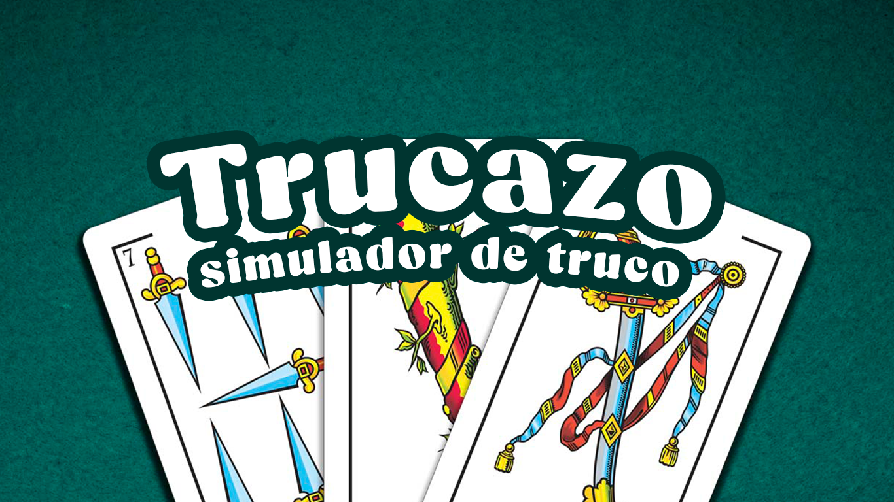
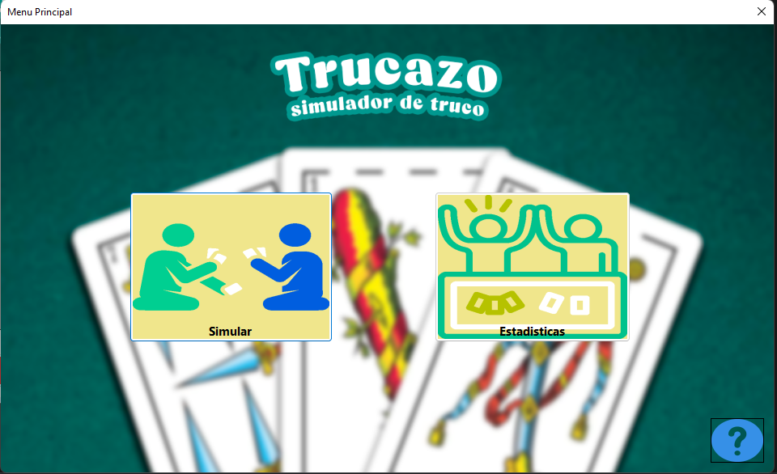
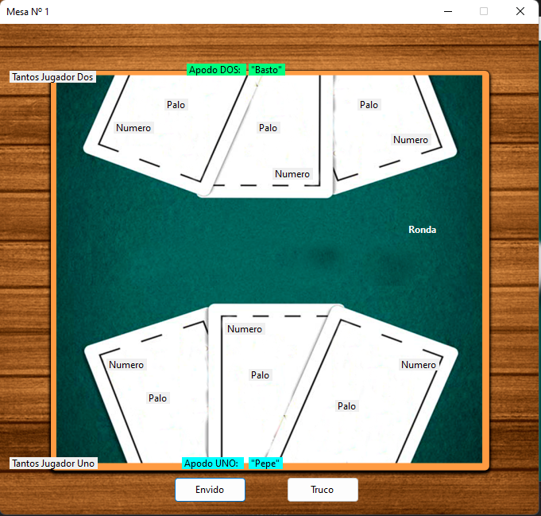
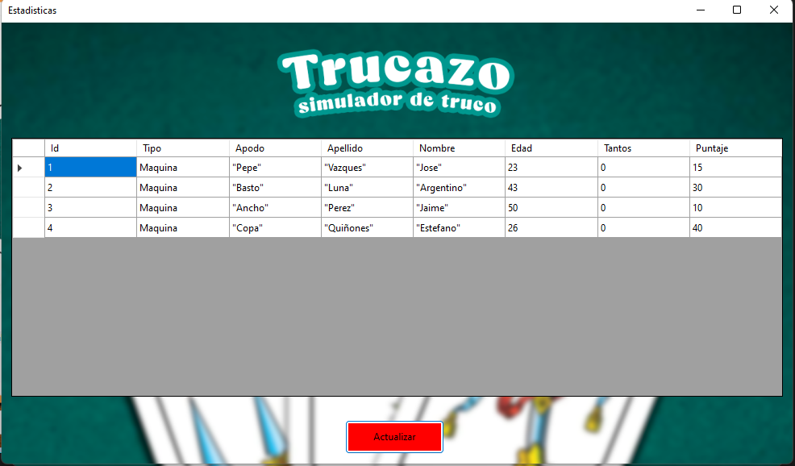
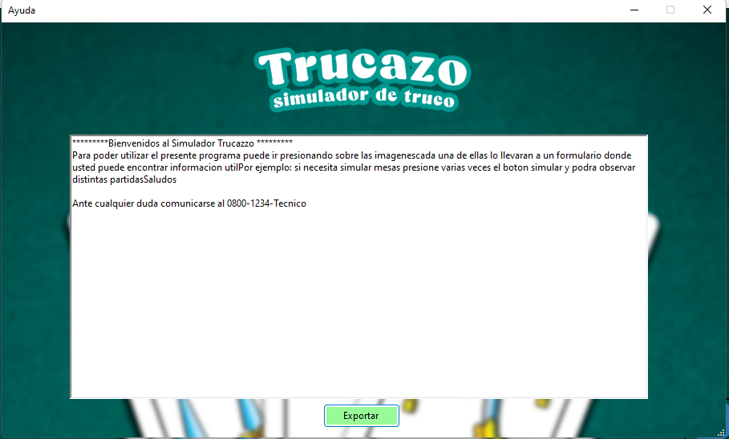
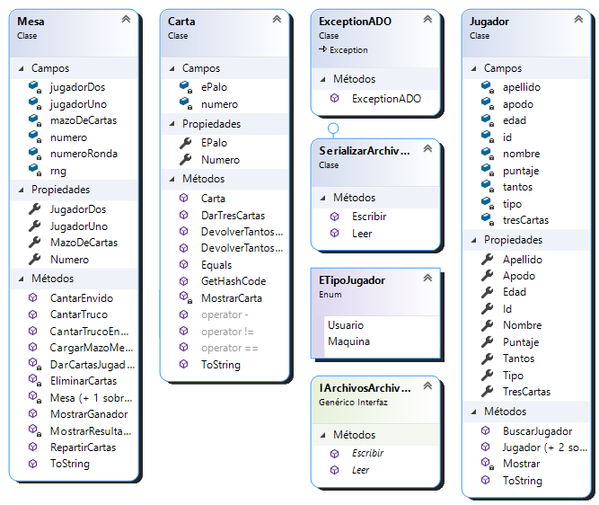
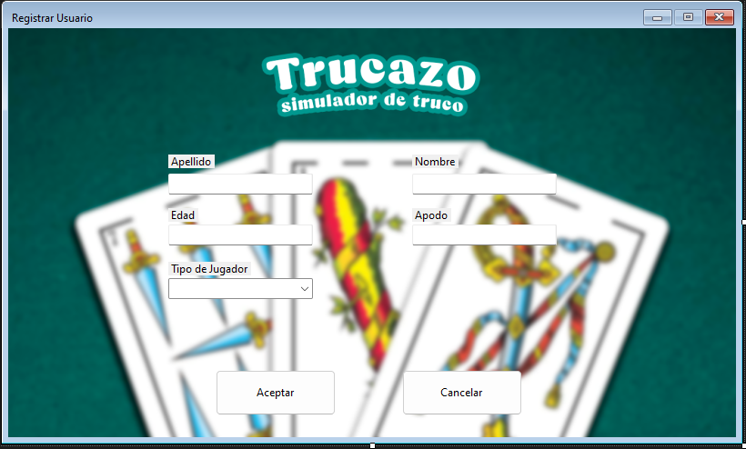

##  Aplicacion Simulador de truco "Trucazo"

## :wave: Sobre mí: 
Soy Esteban Marcelo Quiroz, estudiante de la Tecnicatura Universitaria en Programación.
Como desafio me gusto encontrar con un modelo de probar conocimientos, de una manera diferente
a la convencional, que exista una libertad para crear dentro de unos pautas establecidas, llevandolo al ambito
profesional. 

##  Resumen: qué hace la aplicación y cómo se usa a grandes rasgos.

 ### Menu principal:
 

 ### Mesa donde se juega
 

 ### Estadisticas
 

 ### Ayuda
 

La aplicación simula partidas de usuarios, y proximamente se podra registrar nuevos usuarios.

## Diagrama de clases:

## :computer: Justificación técnica: 

### En los siguientes fragmentos de codigos se demuestra donde se implemento cada tema.

## SQL: trae la lista de jugadores de la base de datos
~~~ C# (lenguaje en el que esta escrito)

 public static List<Jugador> TraerJugadoresADO() 
        {

            try
            {
                sqlConection.Open();
                string command = "SELECT * FROM Usuario";
                SqlCommand sqlCommand = new SqlCommand(command, sqlConection);

                SqlDataReader reader = sqlCommand.ExecuteReader();

                List<Jugador> jugadores = new List<Jugador>();

                while (reader.Read())
                {
                    int id = (int)reader["id"];
                    ETipoJugador tipo = (ETipoJugador)reader["tipo"];
                    string apodo = (string)reader["apodo"];
                    string apellido = (string)reader["apellido"];
                    string nombre = (string)reader["nombre"];
                    int edad = (int)reader["edad"];
                    int puntaje = (int)reader["puntaje"];

                    Jugador jugador = new Jugador(id, tipo, apodo, apellido, nombre, edad, puntaje);
                    jugadores.Add(jugador);
                }

                return jugadores;

            } 
            catch (Exception ex) 
            {
                throw new ExceptionADO("Error en la conexion con la base de datos");
            }
            finally
            {
                if (sqlConection.State != null &&
                    sqlConection.State == System.Data.ConnectionState.Open)
                {
                    sqlConection.Close();
                }

            }

        }

~~~

## Manejo de excepciones: lanza el mensaje si no se pudo conectar a la base de datos

~~~ C# (lenguaje en el que esta escrito)

 public class ExceptionADO : Exception
    {
        public ExceptionADO(string message) : base(message)
        {

        }
    }

~~~

## Unit Testing
~~~ C# (lenguaje en el que esta escrito)

/// 

        /// compara las cartas devolviendo, -1,1,0, dependiendo el caso, segun las reglas del truco
        /// 

        [TestMethod]
        public void ProbarTantosDeTruco()
        {
            Carta cartaUno = new Carta(1, EPalo.Espada);
            Carta cartaDos = new Carta(1, EPalo.Basto);

            //si tanto truco es igual a -1 significa que la carta dos es menor a la carta uno
            int tantoTruco = cartaDos.DevolverTantosTruco(cartaUno);

            Assert.AreEqual(-1, tantoTruco);

        }

~~~

## Generics,Interfases,Serializacion
~~~ C# (lenguaje en el que esta escrito)

 public class SerializarArchivoAyuda : IArchivosArchivoAyuda<string>
    {
        
            public void Escribir(string dato, string path)
            {
                try
                {
                    using (StreamWriter streamWriter = new StreamWriter(path))
                    {
                        streamWriter.WriteLine(dato);
                    }
                }
                catch (Exception)
                {
                    throw;
                }
            }
            //continua en la aplicacion
    }

~~~

## Escritura de archivos: se encuentra en el formulario de ayuda
~~~ C# (lenguaje en el que esta escrito)

 private void btnExportarTxt_Click(object sender, EventArgs e)
        {
            try
            {
                SerializarArchivoAyuda serializarArchivoAyuda = new SerializarArchivoAyuda();
                string path = Environment.GetFolderPath(Environment.SpecialFolder.Desktop) + "\\ ayuda.txt";
                serializarArchivoAyuda.Escribir(CargarInformacionAyuda(), path);
                MessageBox.Show("Vea el archivo en el escritorio", "informacion");
            }
            catch (Exception)
            {
                MessageBox.Show("Error al exportar el archivo en el escritorio", "Error");
                throw;
            }
            
        }

~~~

## Task, Delegados: clase mesa
~~~ C# (lenguaje en el que esta escrito)

public static void CantarTrucoEnMesa(Action<string> cantoTruco, Action<string> cantoQuiero, Action<int> numeroRondas) 
        {
           
            Task.Run(()=> 
            {
                cantoTruco.Invoke("Truco");
                Thread.Sleep(2000);
                cantoQuiero.Invoke("Quiero");
                Thread.Sleep(2000);
                cantoTruco.Invoke(" ");
                cantoQuiero.Invoke(" ");
                numeroRondas.Invoke(numeroRonda++);
                
            });

        }

~~~

## :bulb: Proxima expansion 
### Registrar Usuarios
  

 ## Nota final

 Considero que el codigo podria mejorar muchisimo, creo que hay partes del programa que se podrian mejorar y optimizar, en las proximas versiones se lograra agregar que los usuarios se registren y puedan jugar con sus apodos.